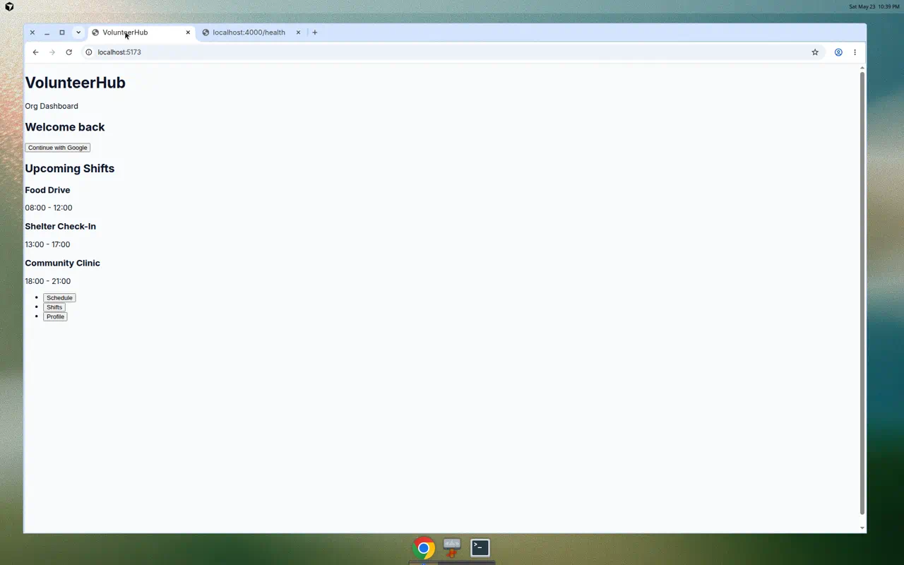
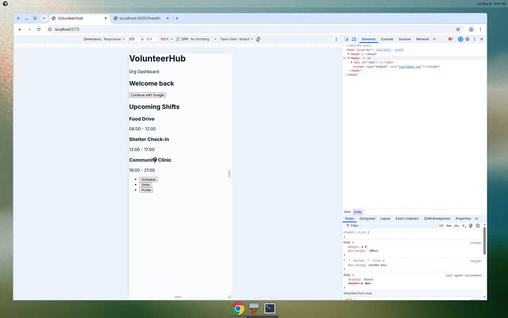

# ContributorHub User Guide

Welcome to ContributorHub! This guide walks you through every screen and feature of the application so you can get started quickly — whether you're an organization admin managing volunteers or a volunteer looking for shifts.

---

## Table of Contents

1. [Overview](#overview)
2. [Getting Started](#getting-started)
3. [Application Layout](#application-layout)
4. [Pages and Screens](#pages-and-screens)
   - [Login Page](#login-page)
   - [Dashboard Page](#dashboard-page)
5. [Navigation](#navigation)
   - [Desktop Navigation](#desktop-navigation)
   - [Mobile Navigation](#mobile-navigation)
6. [User Roles](#user-roles)
7. [Features Guide](#features-guide)
   - [Viewing Shifts](#viewing-shifts)
   - [Managing Shifts (Admin)](#managing-shifts-admin)
   - [Signing Up for Shifts (Volunteer)](#signing-up-for-shifts-volunteer)
   - [Tasks Within Shifts](#tasks-within-shifts)
   - [Skills and Matching](#skills-and-matching)
   - [Calendar Events](#calendar-events)
8. [Frequently Asked Questions](#frequently-asked-questions)

---

## Overview

ContributorHub is a web-based volunteer scheduling platform that helps organizations:

- **Schedule** volunteer shifts with specific times and locations
- **Assign** tasks to individual volunteers within shifts
- **Track** skills and match volunteers to appropriate roles
- **Manage** multiple organizations from a single platform

The application works in any modern web browser (Chrome, Firefox, Safari, Edge) on both desktop computers and mobile devices.

---

## Getting Started

### Accessing the Application

1. Open your web browser
2. Navigate to the ContributorHub URL provided by your organization administrator
3. You will see the login screen

### First-Time Users

If this is your first time using ContributorHub:
1. Click **"Continue with Google"** to sign in with your Google account
2. Your organization admin will assign you to the appropriate organization
3. Once assigned, you'll see your personalized dashboard

---

## Application Layout

The application has a clean, modern layout designed to work on any device.

### Desktop View (Full Application)

**What you see on desktop:**
- **Top:** Navigation header with the ContributorHub logo and your organization badge
- **Middle:** Main content area showing your dashboard, shifts, and other pages
- **Layout:** Wide cards arranged in a grid for easy scanning

The desktop view takes advantage of larger screens to show more information at once, with shift cards arranged side by side.

---

## Pages and Screens

### Login Page

**Purpose:** This is the authentication screen where you sign into your ContributorHub account.

**What's on this screen:**

| Element | Description |
|---------|-------------|
| **"Welcome back"** heading | Greeting message confirming you're on the login page |
| **"Continue with Google" button** | Click this blue button to sign in using your Google account |

**How to use it:**

1. Look for the white card with "Welcome back" at the top
2. Click the blue **"Continue with Google"** button
3. A Google sign-in popup will appear — select your account or enter your Google credentials
4. After successful authentication, you'll be redirected to your dashboard

**Tips:**
- Use the same Google account your organization admin registered you with
- If you don't have a Google account, contact your organization admin for alternative sign-in options
- The button spans the full width of the card for easy clicking on any device

---

### Dashboard Page

**Purpose:** The Dashboard is your home screen after logging in. It shows your upcoming volunteer shifts at a glance so you always know what's next.

**What's on this screen:**

| Element | Description |
|---------|-------------|
| **"Upcoming Shifts"** heading | Section title indicating these are your next scheduled shifts |
| **Shift cards** | White cards showing each shift's name and time |
| **Shift title** | The name of the volunteer activity (e.g., "Food Drive") |
| **Shift time** | The start and end time for the shift (e.g., "08:00 - 12:00") |

**The shift cards displayed:**

| Shift Name | Time | What It Means |
|-----------|------|---------------|
| **Food Drive** | 08:00 - 12:00 | A morning food distribution activity |
| **Shelter Check-In** | 13:00 - 17:00 | An afternoon shift at a shelter |
| **Community Clinic** | 18:00 - 21:00 | An evening health clinic shift |

**How to use it:**

1. After logging in, this page loads automatically
2. Review your upcoming shifts to plan your schedule
3. Each card represents one shift you're signed up for (or available to join)
4. Times are shown in 24-hour format for clarity

**Tips:**
- Shifts are sorted by time, with the earliest first
- On desktop, cards appear in a grid (up to 3 across)
- On mobile, cards stack vertically for easy scrolling
- Look at shift times to avoid scheduling conflicts

---

## Navigation

### Desktop Navigation

**Purpose:** The desktop header provides branding and organization context. It appears at the top of every page when using a computer or tablet in landscape mode.

**What's on this screen:**

| Element | Position | Description |
|---------|----------|-------------|
| **"ContributorHub"** | Left side | The application name/logo — confirms you're in ContributorHub |
| **"Org Dashboard"** badge | Right side | A blue badge showing you're viewing your organization's dashboard |

**How to use it:**
- The header is always visible at the top of the page
- The blue badge confirms which organization context you're currently in
- In the future, clicking "ContributorHub" will return you to the home/dashboard page

---

### Mobile Navigation

**Purpose:** On phones and small tablets, a bottom tab bar replaces the desktop header for thumb-friendly navigation.

**What's on this screen:**

| Element | Position | Description |
|---------|----------|-------------|
| **"Schedule" tab** | Bottom left | View your personal schedule and calendar |
| **"Shifts" tab** | Bottom center | Browse available shifts and manage your signups |
| **"Profile" tab** | Bottom right | View and edit your profile, skills, and preferences |

**How to use it:**

1. Hold your phone normally — the tabs are within easy thumb reach at the bottom
2. Tap **Schedule** to see your personal calendar of upcoming commitments
3. Tap **Shifts** to browse all available shifts you can sign up for
4. Tap **Profile** to manage your account settings and skills

**Tips:**
- The active tab will be highlighted to show which page you're on
- The tab bar is always visible, so you can switch pages from anywhere
- On tablets in portrait mode, you'll see the mobile layout
- Rotate to landscape on tablets to see the desktop layout

---

## User Roles

ContributorHub has three types of users, each with different capabilities:

### Volunteer (Default Role)

**Who:** Anyone who signs up to help with shifts and tasks.

**What you can do:**
- View available shifts for your organization
- Sign up for shifts that match your skills and availability
- See your upcoming schedule
- Complete assigned tasks during shifts
- Update your profile and skills

### Organization Admin (OrgAdmin)

**Who:** Organization managers who coordinate volunteer activities.

**What you can do:**
- Everything a Volunteer can do, plus:
- Create and manage shifts (set times, locations, capacity)
- Define tasks within shifts
- Assign volunteers to specific tasks
- Manage organization skills/competencies
- View all volunteers and their assignments
- Customize organization branding (logo, colors)

### Super Admin

**Who:** Platform administrators who manage the entire ContributorHub installation.

**What you can do:**
- Everything an OrgAdmin can do, plus:
- Create and manage multiple organizations
- Manage all users across organizations
- Configure platform-wide settings

---

## Features Guide

### Viewing Shifts

**What are shifts?**
Shifts are scheduled time blocks when volunteers are needed. Each shift has:
- A **title** describing the activity
- A **start and end time**
- A **location** (where to show up)
- A **capacity** (how many volunteers are needed)
- A **status** (Draft, Open, Filled, or Cancelled)

**Shift statuses explained:**

| Status | Meaning | What to do |
|--------|---------|-----------|
| **DRAFT** | Shift is being planned, not yet visible to volunteers | Wait for admin to publish |
| **OPEN** | Shift is accepting volunteer signups | Sign up if interested! |
| **FILLED** | All spots have been taken | Check back later or look for other shifts |
| **CANCELLED** | Shift has been cancelled | No action needed |

---

### Managing Shifts (Admin)

As an OrgAdmin, you can create and manage shifts:

1. **Create a shift** — Set the title, description, time, location, and capacity
2. **Set required skills** — Specify what competencies volunteers need
3. **Publish the shift** — Change status from DRAFT to OPEN so volunteers can see it
4. **Monitor signups** — Track how many volunteers have signed up
5. **Cancel if needed** — Mark a shift as CANCELLED if plans change

---

### Signing Up for Shifts (Volunteer)

As a volunteer:

1. Browse available shifts on the **Shifts** page (or via the Dashboard)
2. Check the time, location, and required skills
3. Click to sign up for a shift
4. The shift appears on your **Schedule**
5. Show up at the designated time and location!

---

### Tasks Within Shifts

Shifts can be broken down into smaller tasks:

**What are tasks?**
Tasks are specific activities within a shift that can be assigned to individual volunteers. For example, a "Food Drive" shift might have tasks like:
- Set up tables (7:30 AM)
- Sort donations (8:00 AM)
- Distribute food (9:00 AM)
- Clean up (11:30 AM)

**Task statuses:**

| Status | Meaning |
|--------|---------|
| **TODO** | Task hasn't been started yet |
| **IN_PROGRESS** | Someone is currently working on it |
| **DONE** | Task is complete |

---

### Skills and Matching

**What are skills?**
Skills are competencies that your organization defines. Examples:
- First Aid Certified
- Driver's License
- Food Handler's Permit
- Bilingual (Spanish)
- Heavy Lifting Capable

**How skills work:**
1. Admins define skills for the organization
2. Volunteers add skills to their profile
3. Admins can require specific skills for shifts
4. The system helps match qualified volunteers to appropriate shifts

---

### Calendar Events

ContributorHub includes a calendar system to help you visualize your schedule:

- **Internal events** — Created within ContributorHub, automatically linked to shifts
- **Imported events** — Synced from external calendars (iCal format) for a unified view

The calendar shows all-day events and timed events, making it easy to see your full schedule at a glance.

---

## Frequently Asked Questions

### General

**Q: What browser should I use?**
A: ContributorHub works in any modern browser — Chrome, Firefox, Safari, or Edge. We recommend keeping your browser updated to the latest version.

**Q: Does it work on my phone?**
A: Yes! ContributorHub is designed to work on phones, tablets, and desktop computers. The layout automatically adjusts to your screen size.

**Q: Do I need to install anything?**
A: No installation required. ContributorHub runs entirely in your web browser. Just navigate to the URL and start using it.

---

### Account & Login

**Q: How do I create an account?**
A: Click "Continue with Google" and sign in with your Google account. Your organization admin will assign you to the correct organization.

**Q: I can't log in. What should I do?**
A: Make sure you're using the same Google account that was registered with your organization. Contact your organization admin if you continue to have issues.

**Q: Can I use a non-Google email?**
A: Email/password authentication is planned for a future update. Currently, Google sign-in is the primary method.

---

### Shifts & Scheduling

**Q: How do I sign up for a shift?**
A: Navigate to the Shifts page, find an OPEN shift that matches your availability, and click to sign up.

**Q: Can I cancel my signup?**
A: Yes, you can withdraw from a shift before it starts. Be considerate and cancel as early as possible so others can fill the spot.

**Q: What if a shift is FILLED?**
A: All spots are taken. Check back later (someone might cancel) or look for other available shifts.

**Q: How do I know where to go?**
A: Each shift card shows the location. Check the shift details for the full address and any special instructions.

---

### For Admins

**Q: How do I add volunteers to my organization?**
A: Volunteers are added when they sign in and are assigned to your organization. Future updates will include invite links and bulk import.

**Q: Can I create recurring shifts?**
A: Recurring shifts are on the roadmap. For now, create individual shifts for each occurrence.

**Q: How do I customize my organization's branding?**
A: Organization settings allow you to set a custom logo, primary color, and font family. These appear throughout the application for your volunteers.

---

### Technical

**Q: My page looks broken or unstyled.**
A: Try refreshing the page (Ctrl+R or Cmd+R). If the issue persists, clear your browser cache or try a different browser.

**Q: The page is slow to load.**
A: Check your internet connection. If on mobile data, try switching to Wi-Fi. The application is lightweight and should load quickly on most connections.

**Q: I see an error message.**
A: Note the error message and contact your organization admin. If you're a developer, check the [Troubleshooting Guide](./TROUBLESHOOTING.md).

---

## Screenshots Reference

| Screen | Description |
|--------|-------------|
|  | Complete desktop application showing header, login, and shifts |
|  | Mobile layout with bottom tab navigation |

---

*This guide covers the current state of ContributorHub. New features are being actively developed — check back for updates as the platform grows!*
